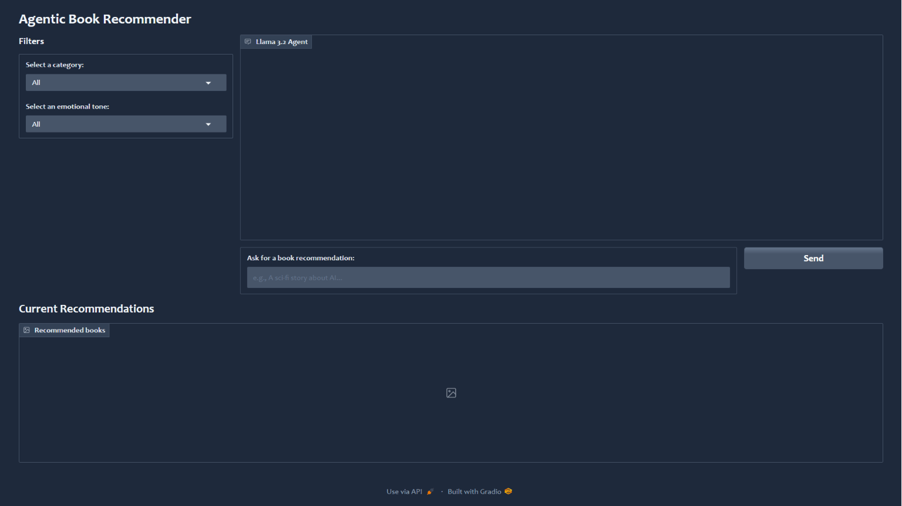

# Agentic Book Recommender

A *semantic book recommendation engine* and conversational *AI agent* that uses Large Language Models (LLMs) and vector search to find books based on natural language queries, specific categories, and emotional tone.

---

## Overview

This project goes beyond simple keyword matching. By leveraging **LangChain**, **LangGraph**, **ChromaDB**, **Hugging Face embeddings**, and an **agent-style workflow**, it allows users to describe what they want to read in plain English and receive semantically relevant book recommendations. The current app also supports category filtering, emotional-tone filtering, and cross-encoder re-ranking for better results.

Additionally, the system includes an **emotion analysis** feature, allowing users to sort recommendations based on the tone of the book (for example, Happy, Suspenseful, Sad).

---

## Features

* **Agentic Workflow (LangGraph):** Utilizes a ReAct(Reasoning and Acting) state machine to autonomously route user requests to context-specific Python tools (e.g., `search_chroma_db`, `filter_by_emotion`).
* **Conversational Memory & Chat UI:** A multi-turn Gradio interface with global state persistence, allowing users to ask follow-up queries (e.g., "Make them sad instead") without losing context.
* **Local Generative Reasoning:** Integrates Llama 3.2 (via Ollama) to analyze vector search results and generate personalized, human-like explanations for recommendations.
* **Semantic Search:** Discover books using natural language descriptions and themes rather than rigid title or author keywords.
* **Emotion & Category Filtering:** Sort and filter recommendations by specific emotional tones and specific genres.
* **Zero-Shot Classification:** Leverages local LLMs to intelligently categorize and assign genre tags to books missing metadata.
* **Cross-Encoder Re-ranking**: Improves recommendation relevance before results are shown.

---

## Interface Demo

Here is the dashboard in action:



---

## Tech Stack

* **Python**: Core programming language.
* **LangChain & LangGraph**: For managing the retrieval, state machines, and LLM ReAct (Reasoning and Acting) agent workflow.
* **Ollama**: For running the local Llama 3.2 reasoning model.
* **ChromaDB**: Vector store for efficient semantic search.
* **Hugging Face Transformers & sentence-transformers**: For text embeddings and related models.
* **Gradio**: For building the web-based user interface.
* **CrossEncoder**: For reranking candidate recommendations.
* **Pandas & NumPy**: For data manipulation and analysis.

---

## Project Structure

* `gradio_dashboard.py`: The main entry point for the Gradio web application.
* `recommendation_engine.py`: The current recommendation logic, tool definitions, LangGraph agent setup, and filtering behavior.
* `data/`: Contains the dataset files such as `books_cleaned.csv`, `books_with_categories.csv`, `books_with_emotions.csv`, and `books.csv`.
* `chroma_db/`: Stores the persisted Chroma vector database.
* `vector_search.ipynb`: Notebook demonstrating how the vector database is built and queried.
* `text_classification.ipynb`: Notebook showing how missing categories were filled using zero-shot classification.
* `sentiment_analysis.ipynb`: Notebook used to analyze the emotional tone of book descriptions.
* `data_exploration.ipynb`: Initial data cleaning and exploration.
* `requirements.txt`: List of Python dependencies.

---

## Getting Started

Follow these steps to clone the repository and run the application on your local machine.

### Prerequisites

* Python 3.10 
* **Ollama** installed and running locally

### Installation

1.  **Clone the repository:**
    ```bash
    git clone https://github.com/saumyaketu/book-recommender-llm.git
    cd book-recommender-llm
    ```

2.  **Create a virtual environment:**
    ```bash
    py -3.10 -m venv llm_env
    .\llm_env\Scripts\Activate.ps1
    ```

3.  **Install the dependencies:**
    ```bash
    pip install -r requirements.txt
    pip install langchain-huggingface
    pip install sentence-transformers
    pip install langchain-ollama
    pip install langgraph
    ```

4. **Download the Local LLM:**

    Open a fresh terminal and run the following command to download the Llama 3.2 (3B) model to your local machine:

    ```bash
    ollama run llama3.2
    ```

### Running the App

1.  **Start Ollama** and make sure the Llama 3.2 model is available locally.
2.  **Launch the dashboard:**
    ```bash
    py gradio_dashboard.py
    ```
3.  **Access the interface:**
    The terminal will output a local URL (usually `http://127.0.0.1:7860`). Open this link in your web browser.
4.  **Use the recommender:**
    * **Chat Interface:** Type a description of the book you are looking for directly into the chat box and press enter.

    * **Follow-ups:** Have a conversation! Ask the agent to filter the current results (e.g., "Make these recommendations sad instead") and watch the gallery update dynamically.

    * **Filters:** (Optional) Use the dropdowns on the left to manually set categories or tones before chatting.

---

## Data Pipeline

The project follows a structured data pipeline:

1.  **Data Cleaning**: Raw book data is cleaned and processed.
2.  **Text Classification**: Missing categories are predicted using a zero-shot classification approach.
3.  **Sentiment Analysis**: Book descriptions are analyzed to determine their emotional probabilities.
4.  **Vector Embedding**: Book descriptions are converted into vector embeddings using the `all-MiniLM-L6-v2` model and stored in ChromaDB.
5.  **Agentic Retrieval and Ranking**: The LangGraph agent queries ChromaDB, applies category and tone filters, and re-ranks candidates before displaying results.

---

## References

The project makes use of the following datasets, models, and libraries:

* **Dataset**: [7k Books Dataset](https://www.kaggle.com/datasets/dylanjcastillo/7k-books-with-metadata)
* **Embeddings Model**: [sentence-transformers/all-MiniLM-L6-v2](https://huggingface.co/sentence-transformers/all-MiniLM-L6-v2) - Used for creating vector representations of book descriptions.
* **Emotion Classification Model**: [j-hartmann/emotion-english-distilroberta-base](https://huggingface.co/j-hartmann/emotion-english-distilroberta-base) - Used for analyzing the emotional tone of the books.
* **Zero-Shot Classification Model**: [facebook/bart-large-mnli](https://huggingface.co/facebook/bart-large-mnli) - Used for predicting missing categories/genres.
* **Libraries**:
    * LangChain
    * LangGraph
    * ChromaDB
    * Gradio
    * Hugging Face Transformers
    * Ollama